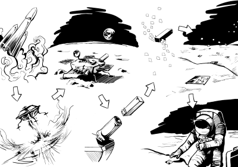
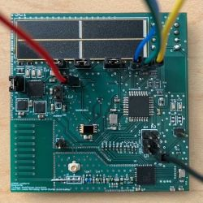
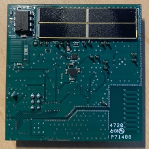

# Great Lunar Expedition For Everyone

[](https://www.gnu.org/licenses/gpl-3.0)
> "We are going to the moon and we'd like to take you along for the ride."

### Table of Contents
You're sections headers will be used to reference location of destination.

- [Project Description](#Project-Description)
- [Library Descriptions](#Library-Descriptions)
- [How To Use](#how-to-use)
- [Social Media](#social-media)

# Project Description

## GLEE Artemis Student Challenge 
The Great Lunar Expedition for Everyone mission will provide accessible opportunities for students to directly participate in Lunar exploration. GLEE will educate, inspire and enable the next generation of explorers with its easy to use LunaSat platform. GLEE's LunaSats, post-it note size wireless enabled sensing nodes, offer a range of functionalities relevant to both Lunar and Earth based scientific investigations. GLEE believes that providing students with LunasSats and associated education content will foster deep learning of many STEM fundamentals. Furthermore, challenging students to identify investigations which utilize standalone and networked LunaSats will foster novel crowdsourced approaches to Lunar exploration while also promoting innovations beneficial to life on Earth. The major goal of GLEE is to deliver and disperse 500 student team owned LunaSats as part of a distributed environmental sensing network on the surface of the moon. The prototyping of LunaSat and creation of educational modules is funded by NASA's Artemis Student Challenge initiative. 

### Announcement Video
[](https://www.youtube.com/watch?v=24ujpW5nN5Q)

## Mission Concept
 

## LunaSat - LUNAr Sensing ArchiTecture
GLEE's current prototype LunaSat is approximately 5cm by 5cm, has a mass of about 5 grams, is solar powered, controlled via an ATMEGA328P and uses LoRA to wirelessly transmit environmental data. 

This repo contains the Arduino libraries and sketches wich are used to control the lunasats. 
### This is a v4 LunaSat
 

### LunaSat Tech (Data Sheets Linked)
* Microprocessor
  - [Atmel ATmega328 (3.3v 16Mhz)](https://ww1.microchip.com/downloads/en/DeviceDoc/ATmega48A-PA-88A-PA-168A-PA-328-P-DS-DS40002061B.pdf)
* Transciever (LoRA)
  - [Semtech SX1272](https://semtech.my.salesforce.com/sfc/p/#E0000000JelG/a/440000001NCE/v_VBhk1IolDgxwwnOpcS_vTFxPfSEPQbuneK3mWsXlU) 
* Ineretial Measurement Unit (IMU)
  - [InvenSense ICM20602](https://invensense.tdk.com/wp-content/uploads/2016/10/DS-000176-ICM-20602-v1.0.pdf)
* Dedicated Temperature Sensor 
  - [Texas Inst. TMP117](https://www.ti.com/lit/ds/symlink/tmp117.pdf?ts=1616690356997&ref_url=https%253A%252F%252Fwww.ti.com%252Fproduct%252FTMP117)
* Thermopile (IR Sensor) 
  - [CalPile TPIS 1S 1385](https://media.digikey.com/pdf/Data%20Sheets/Excelitas%20PDFs/TPiS_1S_1385.pdf)
* Magnetometer
  - [AsahiKASEI AK09940](https://media.digikey.com/pdf/Data%20Sheets/AKM%20Semiconductor%20Inc.%20PDFs/AK09940_Prelim_DS_11-2-18.pdf)
* Other
  - Camera and radiation sensos are also currently in development. 


# How To Use
## Installation Instructions
1. Download and unzip GLEE2023 folder

2. Select the following library folders
    >GLEE_LunaSat\
    >GLEE_Sensor\
    >GLEE_TMP117\
    >GLEE_TPIS1385\
    >GLEE_ICM20602\
    >GLEE_AK09940\
    >GLEE_CAP
    >

3. Move to the following directory
    >Documents\Arduino\Libraries\
    >
    Note: Arduino must be installed and previously ran before arduino libraries forlder apears. This directory can also be found via add library from Arduino IDE

4. Move Module Sketches folder to the following directory
    >Documents\Arduino\

    Module sketches can now be accsessed directly within arduino ide (File > Sketch Book). Library examples will also appear. 

## Sensor Libraries
* GLEE_Sensor: 
  * Parent library providing standard sensor interfacing methods for use by other sensor libraries

* GLEE_TMP117 - Dedicated Temperature Sesnor Functionality
    - Board temperature observations
        ```C++
        #include "TMP117.h"

        // Instantiate TMP117 class with id of 1
        TMP117 thermometer(1);

        float temperature; 

        void setup(){
            Serial.begin(9600);
        };

        void loop(){
            temperature = thermometer.getTemperatureF();
            
            Serial.print("Temperature (C): "); Serial.println(temperature);

            delay(1000);
        };
        ```

* GLEE_ICM20602 - Accelerometer functionality 
    - Acceleration observations
        ```C++
        #include "ICM20602.h"

        ICM20602 accelerometer(0);

        sensor_int16_vec_t accelRaw;
        sensor_float_vec_t acceleration; 

        void setup(){
            Serial.begin(9600);

            accelerometer.begin();

            accelerometer.initialize();

            accelerometer.setScale(AFS_2G);
        };

        void loop(){
            
            accelRaw = accelerometer.getRawAccel();
            acceleration = accelerometer.getGAccel(accelRaw);

            Serial.print("G, X-Axis: "); Serial.println(acceleration.x, 8);
            Serial.print("G, Y-Axis: "); Serial.println(acceleration.y, 8);
            Serial.print("G, Z-Axis: "); Serial.println(acceleration.z, 8);

            delay(200);
        };
        ```

* GLEE_TPIS1385
  * Thermopile sensor - Object temperature observations
    ```C++
    #include "TPIS1385.h"

    TPIS1385 thermopile(1);

    TPsample_t temperatures;

    void setup(){
        Serial.begin(9600);
        thermopile.begin();
        thermopile.readEEprom(); // Prints eeprom and updates calibration constants
    }

    void loop(){
        temperatures = thermopile.getSample();
        Serial.print("Object temperature (F): "); Serial.println(temperatures.object);
        Serial.print("Ambient temperature (F): "); Serial.println(temperatures.ambient);
        delay(1000);
    }
    ```

* GLEE_CAP - Analog capacitance Sensor
    - Analog sensor output observation
        ```C++
        // Include dependencies (libraries)
        #include "Capacitive.h"

        Capacitive cap(1);

        int rawData = 0;

        void setup() {
        Serial.begin(9600); // open serial port, set the baud rate to 9600 bps
        cap.begin();
        }

        void loop(){
            rawData = cap.getRawData();
            
            Serial.println(rawData); //Print raw data
            delay(500);
        };
        ```

* GLEE_AK09940 - Magnetometer Functionality
    - magnetic field observations
        ```C++
        #include "AK09940.h"

        AK09940 magnetometer = AK09940(0);

        AK_Sample_t sample;

        void setup (){
            Serial.begin(9600);
            magnetometer.begin();
            magnetometer.readWAI();
            magnetometer.setOpMode(true, LOW_POWER_1, POWER_DOWN);
        };

        void loop (){   
            Serial.print(F("Data Ready Pin Showing: ")); Serial.println(magnetometer.dataReady());

            sample = magnetometer.getSample();

            Serial.print(F("Magnetometer Temp: ")); Serial.println(sample.temp,5);
            Serial.print(F("Mag X (nT): ")); Serial.println(sample.magnetic.x,5);
            Serial.print(F("Mag Y (nT): ")); Serial.println(sample.magnetic.y,5);
            Serial.print(F("Mag Z (nT): ")); Serial.println(sample.magnetic.z,5);
            Serial.print(F("Magnetic Field Magnitude: ")); Serial.println(sample.strength);

            delay(1000); // Take samples every one sec
        };
        ```

## Integrated Library
* GLEE_LunaSat - Integrated sensor, RF and IO functionality 
    * This library brings all lunasat functionality into one place
    - Dynamic sampling of observations from all sensors
    ```C++
    #include <LunaSat.h>    

    // Set lunasat configuration (1's equates to default mode)
    int lunaSatConfig[6] = {1,1,0,1,1,1}; // Configuration format: {TMP117, ICM20602, AK09940, TIPS1385, CAP, SX1272}

    // LunaSat object initialization is used for declaration of parameters such as ID and debugging mode
    LunaSat lunaSat(0, lunaSatConfig, false);

    // Custom datatypes allow for sample specialization, user can craft their own ideal sample
    lunaSat_sample_t sample;  

    void setup() {
        // The GLEE library architecture enables easy, interpretable and familiar programming of the lunasat
        lunaSat.begin(9600);    // Direct serial communications with computer
        delay(5000);
    }

    void loop() {
        // Simple fetching of sensor observation using lunasat class 
        // Later versions will allow for dynamic sampling based on user defined config
        sample = lunaSat.getSample(); 

        // Simple examples of interacting with an observation sample
        lunaSat.dispSample(sample); // Observation samples can be directly displayed via serial
        
        delay(100);
    }
    ```

* GLEE_RF - SX1272 radiolib implementation/integration
  - Basic Transmission Example
    ```C++
    #include <GLEE_Radio.h>

    LunaRadio Rad;

    void setup() {
      Serial.begin(9600);
      Rad.initialize_radio();
    }

    void loop() {
      Rad.transmit_data("Hello World!");
      delay(1000);  
    }
    ```
  - Basic Reception Example
    ```C++
    #include <GLEE_Radio.h>

    LunaRadio Rad;

    void setup() {
      Serial.begin(9600);
      
      Rad.initialize_radio();
    }

    void loop() {
      String output = Rad.receive_data_string();
      
      Serial.println(output);
    }
    ```

# Social Media
- [GLEE2023 Website](https://www.glee2023.org/)
- [Youtube](https://www.youtube.com/channel/UC7olPe8j-Idpru-aBO6vDRA)
- [Instagram](https://www.instagram.com/gleemission2023/)

# README TODOS
* TODO: Embedded links to libraries

