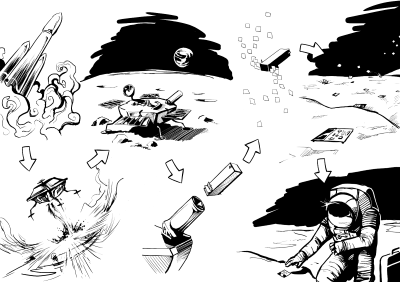
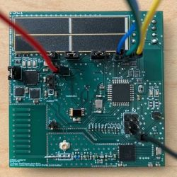
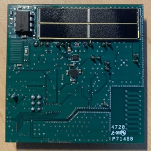

# Great Lunar Expedition For Everyone

[](https://www.gnu.org/licenses/gpl-3.0)
> "We are going to the moon and we'd like to take you along for the ride."

### Table of Contents
- [Project Description](#Project-Description)
- [Library Contents](#Library-Descriptions)
- [How To Use](#how-to-use)
- [Social Media](#social-media)

# Project Description

## GLEE Artemis Student Challenge 
The Great Lunar Expedition for Everyone mission will provide accessible opportunities for students to directly participate in Lunar exploration. GLEE will educate, inspire and enable the next generation of explorers with its easy to use LunaSat platform. GLEE's LunaSats, post-it note size wireless enabled sensing nodes, offer a range of functionalities relevant to both Lunar and Earth based scientific investigations. GLEE believes that providing students with LunasSats and associated education content will foster deep learning of many STEM fundamentals. Furthermore, challenging students to identify investigations which utilize standalone and networked LunaSats will foster novel crowdsourced approaches to Lunar exploration while also promoting innovations beneficial to life on Earth. The major goal of GLEE is to deliver and disperse 500 student team owned LunaSats as part of a distributed environmental sensing network on the surface of the moon. The prototyping of LunaSat and creation of educational modules is funded by NASA's Artemis Student Challenge initiative. 

### Announcement Video
<center>
<href="https://www.youtube.com/watch?v=24ujpW5nN5Q"> 
</center>


## Mission Concept
 
<center>

</center> 
Art by Daedalus Muse

## LunaSat - LUNAr Sensing ArchiTecture
GLEE's current prototype LunaSat is approximately 6cm by 6cm, has a mass of about 5 grams, is solar powered, controlled via an ATMEGA328P and uses LoRA to wirelessly transmit environmental data. 

This repo contains the Arduino libraries and sketches which are used to control the LunaSats. 
### This is a v4 LunaSat
 

### LunaSat Tech (with linked Data Sheets)
* Microprocessor
  - [Atmel ATmega328 (3.3v 16Mhz)](https://ww1.microchip.com/downloads/en/DeviceDoc/ATmega48A-PA-88A-PA-168A-PA-328-P-DS-DS40002061B.pdf)
* Transceiver (LoRA)
  - [Semtech SX1272](https://semtech.my.salesforce.com/sfc/p/#E0000000JelG/a/440000001NCE/v_VBhk1IolDgxwwnOpcS_vTFxPfSEPQbuneK3mWsXlU) 
* Inertial Measurement Unit (IMU)
  - [InvenSense MPU6000](https://product.tdk.com/system/files/dam/doc/product/sensor/mortion-inertial/imu/data_sheet/mpu-6000-datasheet1.pdf)
* Dedicated Temperature Sensor 
  - [Texas Inst. TMP117](https://www.ti.com/lit/ds/symlink/tmp117.pdf?ts=1616690356997&ref_url=https%253A%252F%252Fwww.ti.com%252Fproduct%252FTMP117)
* Infrared Temperature Sensor
  - [CalPile TPIS 1S 1385](https://media.digikey.com/pdf/Data%20Sheets/Excelitas%20PDFs/TPiS_1S_1385.pdf)
* Magnetometer
  - [Melexis MLX90393](https://www.melexis.com/en/documents/documentation/datasheets/datasheet-mlx90393)
* Other
  - Camera and radiation sensors are also currently in development. 


# How To Use
## Installation Instructions
1. Open Arduino
2. Navigate to `file > tools > library manager`
3. Search for GLEE2023
4. Install with dependencies

## Sensor Libraries
* GLEE_Sensor: 
  * Parent library providing standard sensor interfacing methods for use by other sensor libraries.

* GLEE_TMP117 - Dedicated Temperature Sensor Functionality
    - Board Temperature Observations
        ```C++
        #include "TMP117.h"

        // Instantiate TMP117 class with id of 1
        TMP117 thermometer(1);

        float temperature; 

        void setup(){
            Serial.begin(9600);
        };

        void loop(){
            temperature = thermometer.getTemperatureF();
            
            Serial.print("Temperature (C): "); Serial.println(temperature);

            delay(1000);
        };
        ```

* GLEE_MPU6000 - Accelerometer Functionality 
    - Acceleration Observations
        ```C++
        #include "MPU6000.h"

        MPU6000 accelerometer(1, false); // Sets sensor ID to 1 and debugging to false
        sensor_float_vec_t acc; // Saves acceleration readings in a vector structure

        void setup(){
            Serial.begin(9600); // Sets baud rate to 9600 for serial transmission and starts serial communication
            accelerometer.begin(); // Begins transmission to the I2C slave device
            accelerometer.initialize(); // Set-up for MPU 
            accelerometer.setAccelRange(MPU6000_RANGE_2_G); // Sets range of acccelrometer Range options: 2_G, 4_G, 8_G, 16_G
        }

        void loop(){
            acc = accelerometer.getSample(); // Gets and saves 3-axis acceleration reading (G)

            Serial.print("Acceleration in Gs, X-Axis: "); Serial.print(acc.x, 8); // Prints out 3-axis acceleration (G)
            Serial.print(" Y-Axis: "); Serial.print(acc.y, 8);
            Serial.print(" Z-Axis: "); Serial.print(acc.z, 8);
            Serial.println();

            delay(100); // Waits 100ms between readings
        }
        ```

* GLEE_TPIS1385 - Thermopile Functionality
  * Thermopile sensor - Object Temperature Observations
    ```C++
    #include "TPIS1385.h"

    TPIS1385 thermopile(1);

    TPsample_t temperatures;

    void setup(){
        Serial.begin(9600);
        thermopile.begin();
        thermopile.readEEprom(); // Prints eeprom and updates calibration constants
    }

    void loop(){
        temperatures = thermopile.getSample();
        Serial.print("Object temperature (F): "); Serial.println(temperatures.object);
        Serial.print("Ambient temperature (F): "); Serial.println(temperatures.ambient);
        delay(1000);
    }
    ```

* GLEE_CAP - Capacitance Functionality
    - Analog sensor output observation
        ```C++
        // Include dependencies (libraries)
        #include "Capacitive.h"

        Capacitive cap(1);

        int rawData = 0;

        void setup() {
        Serial.begin(9600); // open serial port, set the baud rate to 9600 bps
        cap.begin();
        }

        void loop(){
            rawData = cap.getRawData();
            
            Serial.println(rawData); //Print raw data
            delay(500);
        };
        ```

* GLEE_MLX90393 - Magnetometer Functionality
    - Magnetic Field Observations
        ```C++
        #include "MLX90393.h"

        MLX90393 magnetometer = MLX90393(1,false);

        mlx_sample_t sample;

        void setup (){
            Serial.begin(9600);

            magnetometer.begin_I2C();

            // Set gain
            magnetometer.setGain(MLX90393_GAIN_2_5X);

            // Set resolution
            magnetometer.setResolution(MLX90393_X, MLX90393_RES_19);
            magnetometer.setResolution(MLX90393_Y, MLX90393_RES_19);
            magnetometer.setResolution(MLX90393_Z, MLX90393_RES_16);

            // Set oversampling
            magnetometer.setOversampling(MLX90393_OSR_2);

            // Set digital filtering
            magnetometer.setFilter(MLX90393_FILTER_6);

        };

        void loop (){   

            sample = magnetometer.getSample();

            // Print out magnetic field measurements for each axis 
            Serial.println("Magnetic Field Axes Measurements");
            Serial.print("X: "); Serial.print(sample.magnetic.x,4); Serial.println(" uT");
            Serial.print("Y: "); Serial.print(sample.magnetic.y,4); Serial.println(" uT");
            Serial.print("Z: "); Serial.print(sample.magnetic.z,4); Serial.println(" uT");
            Serial.println();
            // Print out strength of magnetic field
            Serial.println("Magnetic Field Strength (Magnitude)"); 
            Serial.print(sample.strength,4); Serial.println(" uT");
            Serial.println();

            delay(1000); // Take samples every one second
        };
        ```

## Integrated Library
* GLEE_LunaSat - Integrated Sensor, RF and IO Functionality 
    * This library brings all LunaSat functionality into one place
    - Dynamic sampling of observations from all sensors
      ```C++
      #include <LunaSat.h>    

      // Set lunasat configuration (1's equates to default mode)
      int lunaSatConfig[6] = {1,1,0,1,1,1}; // Configuration format: {TMP117, ICM20602, AK09940, TIPS1385, CAP, SX1272}

      // LunaSat object initialization is used for declaration of parameters such as ID and debugging mode
      LunaSat lunaSat(0, lunaSatConfig, false);

      // Custom datatypes allow for sample specialization, user can craft their own ideal sample
      lunaSat_sample_t sample;  

      void setup() {
          // The GLEE library architecture enables easy, interpretable and familiar programming of the lunasat
          lunaSat.begin(9600);    // Direct serial communications with computer
          delay(5000);
      }

      void loop() {
          // Simple fetching of sensor observation using lunasat class 
          // Later versions will allow for dynamic sampling based on user defined config
          sample = lunaSat.getSample(); 

          // Simple examples of interacting with an observation sample
          lunaSat.dispSample(sample); // Observation samples can be directly displayed via serial
          
          delay(100);
      }
      ```

* GLEE_RF - SX1272 Radiolib Implementation/Integration
  - Basic Transmission Example
    ```C++
    #include <GLEE_Radio.h>

    LunaRadio Rad;

    void setup() {
      Serial.begin(9600);
      Rad.initialize_radio();
    }

    void loop() {
      Rad.transmit_data("Hello World!");
      delay(1000);  
    }
    ```
  - Basic Reception Example
    ```C++
    #include <GLEE_Radio.h>

    LunaRadio Rad;

    void setup() {
      Serial.begin(9600);
      
      Rad.initialize_radio();
    }

    void loop() {
      String output = Rad.receive_data_string();
      
      Serial.println(output);
    }
    ```

# Social Media
- [GLEE2023 Website](https://www.glee2023.org/)
- [Youtube](https://www.youtube.com/channel/UC7olPe8j-Idpru-aBO6vDRA)
- [Instagram](https://www.instagram.com/gleemission2023/)

# README TODOS
* TODO: Embedded links to libraries
